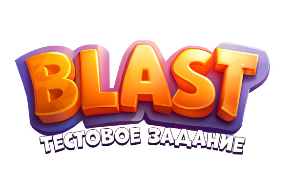

# Тестовое задание (TapClab)

# [Играть](https://jimgames.ru/blast/)

## Игра с механикой Blast
В этой игре вам предстоит нажимать на группы одинаковых блоков, чтобы зарабатывать очки. Чем больше блоков вы разрушите за один ход, тем больше очков получите.

## Цель игры
Ваша задача — набрать необходимое количество очков за ограниченное коооличество ходов.

## Бустеры
В вашем распоряжении есть бустеры, вы можете взорвать 5 клеток используя бомбу или переместить 2 блока используя волшебную палочку.
<!--  -->

### Технические моменты: 
TypeScript + Phaser 3 + Webpack

